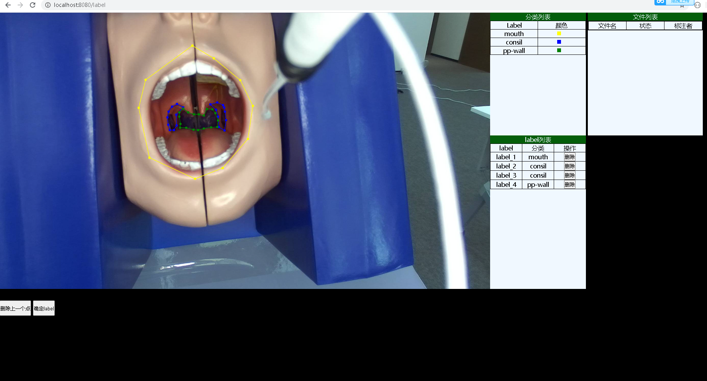

# LabelOwl
多人线上标注系统(就像线上多人版的labelme)

## 系统结构
- 前端: vue.js
- 服务端: golang + iris

## 开发环境
- node.js 14.4.0
- golang 1.14.4

## 已实现功能
### 标注页面
- 在画布通过鼠标点击画出label
- 删除上一个标注的点
- 显示当前标注任务的所有分类与对应label颜色
- 显示已标注的label
- 能删除已标注的label

## 已知bug

## TODO- LIST
- 隐藏label图层功能

## 当前运行界面
